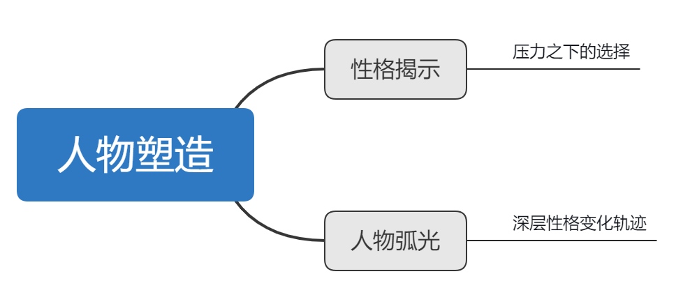

# 角度\#07 人物塑造

人物塑造方面讲性格揭示和人物弧光两点。

## 1.性格揭示 

> 《故事》：生活教给我们这一宏大原则：看似如此其实并非如此。人不可貌相。表面特征下掩盖着一个深藏的本性。无论他们言说什么，无论他们举止如何，**若要了解深层的人物性格，唯一的途径就是通过他们在压力之下做出的选择。**

《Lost & Found》：当最后小恐龙被门挡住：这是一个有意而为的静态时刻，渺小残破的躯体面对着巍峨耸立的门，这一画面上的强烈反差更加凸显出小恐龙的绝望心情，并让观众的紧张感积累得快要爆炸。 在这令人绝望的压力面前，小恐龙必须做一个选择，是继续还是放弃？他要为赢得自己的欲望对象（小狐狸的生命）做出最后的努力。 在这最后的选择中，我们对小恐龙有了更深刻的认识，明白了他把爱人看得比死亡还要重要。

## 2.人物弧光 

> 《故事》：最优秀的作品不但揭示人物性格真相，而且还在其讲述过程中**展现人物内在本性中的弧光或变化**，无论变好还是变坏。

我们可以从影片开始阶段展现的一些细节中看出主角徐硕宇也是一个只注重自己利益的人，除了家人外不太在乎其他人的利益甚至是性命。

比如一开始在办公室和金代理的对话，说全部抛售，不考虑散户利益；关门阻止壮汉和孕妇进来；告诉女儿可以不顾虑别人的生死；

在影片的进行中，主角徐硕宇明显发生了变化，他开始积极地对抗丧尸，彰显出勇敢的一面，最后甚至牺牲自己拯救了孕妇和女儿：

这一人物深层次的性格变化就像一道弧形闪光璀璨夺目，打动了观众们的心。

